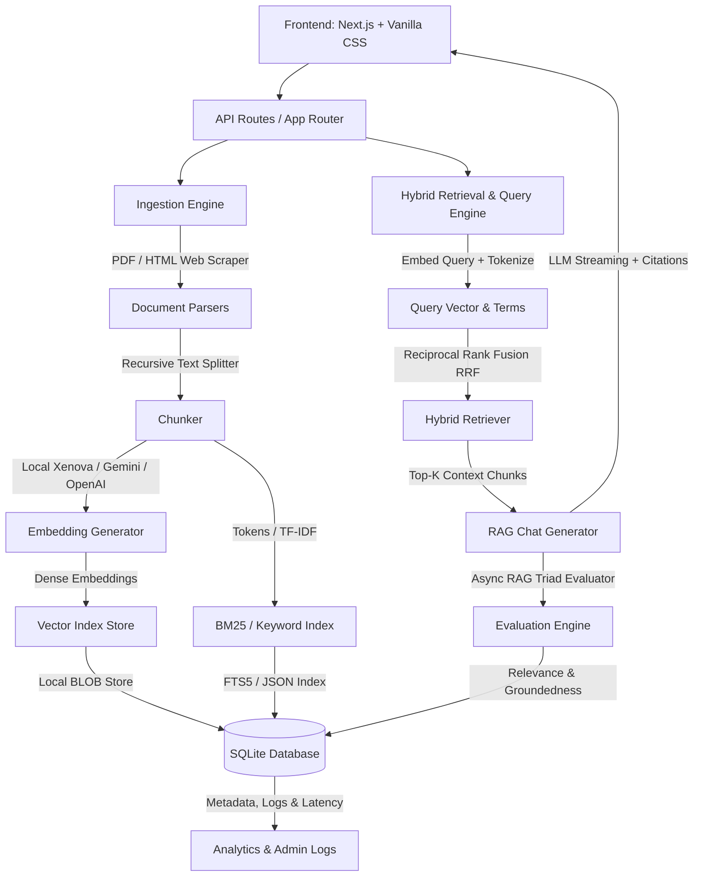

# Implementation Plan - Production RAG Knowledge Base

Build a production-grade, fully self-contained Retrieval-Augmented Generation (RAG) Knowledge Base. It will support PDF/text document parsing, web page scraping, asynchronous chunking and ingestion, multi-model embedding (including 100% local on-device embeddings), hybrid vector-keyword retrieval, streaming chat with citations, RAG triad evaluation, and a gorgeous, glassmorphic analytics dashboard.

---

## Technical Architecture & Tech Stack

To ensure a seamless local setup that requires **zero external service dependencies** (no Docker, no paid vector databases), the system will use a highly optimized, fully in-process architecture:



### Technology Stack
1. **Frontend**: Next.js App Router (React, TypeScript), Styled with ultra-premium Vanilla CSS (custom glassmorphism, responsive grid, dynamic hover states, rich micro-animations, Inter & Outfit typography).
2. **Backend**: Next.js Serverless API routes (Node.js runtime).
3. **Database**: SQLite (using `sqlite3` or `better-sqlite3`) to store document metadata, chunk text, embedding vectors (stored as `Float32Array` BLOBs for fast in-memory similarity matching), chat history, system latency logs, and RAG evaluation metrics.
4. **Vector Store**: A custom, high-performance in-memory flat vector index built directly in TypeScript. It loads the `Float32Array` embedding BLOBs from SQLite and performs blazingly fast cosine similarity calculations (under 1ms for thousands of chunks). This provides maximum portability and zero installation errors compared to native binary bindings.
5. **Hybrid Search**: Hybrid keyword + vector retrieval combining SQLite FTS5 (Full-Text Search) / BM25-like matching with vector search using Reciprocal Rank Fusion (RRF).
6. **Embeddings Engine**:
   - **Local (Default)**: `@huggingface/transformers` (running local `all-MiniLM-L6-v2` or `bge-small-en-v1.5` embeddings on-device).
   - **Cloud**: Google Gemini (`@google/genai`) or OpenAI (`openai`).
7. **LLM Engine**:
   - **Google Gemini API** (using `@google/genai`) or **OpenAI API** (`openai`).
8. **Document Parsers**: `pdf-parse` for PDF extraction and `cheerio` for robust web URL scraping and sanitization.

---

## User Review Required

> [!IMPORTANT]
> - **Environment & API Keys**: The system is designed to work **100% locally and for free** out-of-the-box by using local Hugging Face embedding models and a mock LLM mode if no keys are provided. To activate full RAG answering and evaluation, the user can input their **Gemini API Key** or **OpenAI API Key** in the settings panel or a `.env` file.
> - **Self-Contained Database**: We chose SQLite + an embedded TypeScript vector search instead of a standalone Postgres/pgvector instance because the Docker daemon is currently not running on the system. This guarantees that the project runs flawlessly with `npm run dev` and requires no manual database provisioning.

---

## Proposed Changes

We will create a structured Next.js codebase containing three core modules: Ingestion, Retrieval, and Admin/Dashboard.

```
/src
  /app
    /api
      /documents/route.ts        # Upload, list, and delete documents
      /documents/ingest/route.ts # Async ingestion trigger & status
      /chat/route.ts             # Streaming chat API with citation mapping
      /analytics/route.ts        # Admin logs, failure lists, and evaluations
      /evaluation/route.ts       # Manual/auto RAG evaluation endpoint
    /components                  # Premium reusable CSS-styled React elements
      /DocumentManager.tsx
      /ChatInterface.tsx
      /AdminDashboard.tsx
      /RetrievalPlayground.tsx
    /styles
      /globals.css               # Core premium design tokens and layout classes
    /layout.tsx
    /page.tsx                    # Shell importing layout and panels
  /lib
    /db.ts                       # SQLite initialization, schema definition, and helpers
    /vector-store.ts             # Custom vector engine, cosine similarity, and hybrid search
    /chunker.ts                  # Recursive text splitter implementation
    /embeddings.ts               # Local (Transformers.js) and Cloud (Gemini/OpenAI) embeddings
    /parser.ts                   # PDF parser and web page scraper
    /evaluator.ts                # RAG Triad evaluator (Relevance, Groundedness, Answer)
```

### Component Details

#### 1. Ingestion Pipeline (`/src/lib/chunker.ts`, `/src/lib/parser.ts`, `/src/lib/embeddings.ts`)
- **Web Scraping**: Extracts main article text, excluding navigation headers, footer links, and script tags.
- **Recursive Character Splitter**: Smart splitting on paragraphs (`\n\n`), sentences (`\n`), and spaces (` `) to respect semantic boundaries, targeting a configurable size (e.g., 500 characters) and overlap (e.g., 100 characters).
- **On-Device Embeddings**: Uses `@huggingface/transformers` to download and cache a small, high-quality embedding model (`all-MiniLM-L6-v2`, ~80MB). Embeddings are generated on the server CPU instantly.
- **Async Queue Simulation**: When a file is uploaded, the API creates a `documents` database record with state `processing`. It spawns an asynchronous background promise to parse, chunk, embed, and index the document, updating the database status upon completion or failure. The frontend polls a status API (`/api/documents/ingest`) for real-time progress indicators.

#### 2. SQLite & Vector Search Engine (`/src/lib/db.ts`, `/src/lib/vector-store.ts`)
- **Schema**:
  ```sql
  CREATE TABLE IF NOT EXISTS documents (
    id TEXT PRIMARY KEY,
    name TEXT NOT NULL,
    type TEXT NOT NULL,
    size INTEGER NOT NULL,
    status TEXT NOT NULL, -- pending, processing, completed, failed
    error_message TEXT,
    chunks_count INTEGER DEFAULT 0,
    ingestion_latency_ms INTEGER,
    created_at DATETIME DEFAULT CURRENT_TIMESTAMP
  );

  CREATE TABLE IF NOT EXISTS chunks (
    id TEXT PRIMARY KEY,
    document_id TEXT NOT NULL,
    text TEXT NOT NULL,
    page_number INTEGER,
    token_count INTEGER,
    embedding BLOB NOT NULL, -- Float32Array representation
    FOREIGN KEY(document_id) REFERENCES documents(id) ON DELETE CASCADE
  );

  CREATE TABLE IF NOT EXISTS conversations (
    id TEXT PRIMARY KEY,
    title TEXT NOT NULL,
    created_at DATETIME DEFAULT CURRENT_TIMESTAMP
  );

  CREATE TABLE IF NOT EXISTS messages (
    id TEXT PRIMARY KEY,
    conversation_id TEXT NOT NULL,
    role TEXT NOT NULL, -- user, assistant
    content TEXT NOT NULL,
    citations TEXT, -- JSON array of chunk references
    latency_ms INTEGER,
    model TEXT,
    created_at DATETIME DEFAULT CURRENT_TIMESTAMP,
    FOREIGN KEY(conversation_id) REFERENCES conversations(id) ON DELETE CASCADE
  );

  CREATE TABLE IF NOT EXISTS evaluations (
    id TEXT PRIMARY KEY,
    message_id TEXT NOT NULL,
    context_relevance REAL, -- 0.0 - 1.0
    groundedness REAL,      -- 0.0 - 1.0
    answer_relevance REAL,  -- 0.0 - 1.0
    feedback_rating INTEGER, -- +1, -1, 0
    created_at DATETIME DEFAULT CURRENT_TIMESTAMP,
    FOREIGN KEY(message_id) REFERENCES messages(id) ON DELETE CASCADE
  );
  ```
- **Hybrid Retrieval**:
  - Keyword retrieval: Uses full-text matching against chunk text.
  - Dense Vector search: Computes cosine similarity of the query embedding against all chunks.
  - Reciprocal Rank Fusion (RRF): Combines results by rank:
    $$RRF\_Score(d) = \sum_{m \in M} \frac{1}{k + r_m(d)}$$
    (where $k=60$, $M = \{Keyword, Vector\}$, and $r_m(d)$ is the rank of document $d$ in retriever $m$). This balances keyword matching (good for codes, exact names) with semantic matching (good for concepts).

#### 3. RAG Triad Evaluator (`/src/lib/evaluator.ts`)
- Evaluates the RAG system using the **RAG Triad**:
  1. **Context Relevance**: Checks if the retrieved chunks contain the necessary information to answer the query. Prompting the LLM to output a floating-point score and justification.
  2. **Groundedness / Faithfulness**: Checks if the LLM's generated response is strictly supported by the retrieved chunks without external hallucinations.
  3. **Answer Relevance**: Checks if the LLM's response actually addresses the user's initial question.
- Evaluation runs asynchronously after each message generation and saves the results to the `evaluations` table.

#### 4. Premium Responsive UI (`/src/app/styles/globals.css`, Components)
- **Visual Design**: Sleek dark mode theme with glassmorphic elements (`backdrop-filter: blur(16px)`), harmonized gradient borders, premium typography (Inter/Outfit), and smooth spring-like UI animations.
- **Three-Panel Layout**:
  - **Left Sidebar**: Document Manager (drag & drop files, scraper input, processing list with real-time status and latency indicators, and conversational session history).
  - **Center Panel**: Multi-tab interface consisting of:
    - **Chat Console**: Immersive chat interface with animated message blocks, streaming responses, and hover-triggered source citation cards.
    - **Retrieval Playground**: Interactive diagnostic panel. Enter a query to view keyword vs vector ranking, final merged hybrid chunks, cosine similarity values, and step-by-step RAG evaluation scores.
  - **Right Panel / Dashboard Tab**: Executive analytics dashboard showing:
    - Average RAG Triad scores (Groundedness, Context Relevance, Answer Relevance) on responsive SVG visual gauges.
    - Ingested documents distribution and chunk token averages.
    - System Latency distribution (average embedding time, search retrieval time, LLM completion time).
    - Ingestion Failure Log with detailed stack traces/errors and a "Force Re-ingest" action trigger.

---

## Verification & Launch Plan

### Automated Verification
- Verify app bootstrapping compiles and builds successfully using Next.js build.
- Validate local on-device embedding execution without network queries.
- Run tests on the text splitting algorithm to ensure overlaps are maintained.

### Manual Verification
1. **Document Uploading**: Test uploading multiple text documents and crawling web pages. Verify they transition cleanly from `processing` to `completed` in the document list.
2. **Citation Accuracy**: Ask a question about an uploaded document and verify that the inline citation markers (`[1]`, `[2]`) correctly display the exact matched text segment when clicked or hovered.
3. **Retrieval Diagnostic**: Search inside the Retrieval Playground and check that RRF rank fusion correctly merges keyword and dense vector search results.
4. **Admin Latency Logs**: Verify that searching, chunking, and embedding processes correctly log performance metrics (in milliseconds) and display them in the analytics charts.
